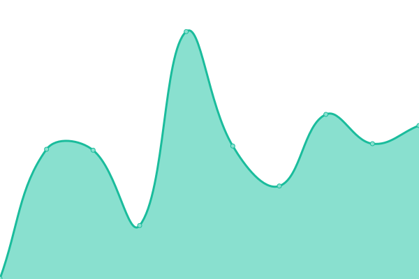

# [📈 Live Status](https://deer-wmde.github.io/wikibase-dev-uptime): <!--live status--> **🟧 Partial outage**

This repository contains the open-source uptime monitor and status page for [Deniz Erdogan](https://deer-wmde.github.io/wikibase-dev-uptime), powered by [Upptime](https://github.com/upptime/upptime).

With [Upptime](https://upptime.js.org), you can get your own unlimited and free uptime monitor and status page, powered entirely by a GitHub repository. We use [Issues](https://github.com/deer-wmde/wikibase-dev-uptime/issues) as incident reports, [Actions](https://github.com/deer-wmde/wikibase-dev-uptime/actions) as uptime monitors, and [Pages](https://deer-wmde.github.io/wikibase-dev-uptime) for the status page.

<!--start: status pages-->
<!-- This summary is generated by Upptime (https://github.com/upptime/upptime) -->
<!-- Do not edit this manually, your changes will be overwritten -->
<!-- prettier-ignore -->
| URL | Status | History | Response Time | Uptime |
| --- | ------ | ------- | ------------- | ------ |
|  [Frontend](https://www.wikibase.dev/) | 🟩 Up | [frontend.yml](https://github.com/deer-wmde/wikibase-dev-uptime/commits/HEAD/history/frontend.yml) | 

 401ms
     
 | 

<a href="https://deer-wmde.github.io/wikibase-dev-uptime/history/frontend">100.00%</a>
    

|  [API](https://api.wikibase.dev/healthz) | 🟩 Up | [api.yml](https://github.com/deer-wmde/wikibase-dev-uptime/commits/HEAD/history/api.yml) | 

 589ms
     
 | 

<a href="https://deer-wmde.github.io/wikibase-dev-uptime/history/api">100.00%</a>
    

|  [Mediawiki](https://coffeebase.wikibase.dev/) | 🟩 Up | [mediawiki.yml](https://github.com/deer-wmde/wikibase-dev-uptime/commits/HEAD/history/mediawiki.yml) | 

 999ms
     
 | 

<a href="https://deer-wmde.github.io/wikibase-dev-uptime/history/mediawiki">100.00%</a>
    

|  [Wikibase](https://coffeebase.wikibase.dev/wiki/Item:Q1) | 🟩 Up | [wikibase.yml](https://github.com/deer-wmde/wikibase-dev-uptime/commits/HEAD/history/wikibase.yml) | 

 350ms
     
 | 

<a href="https://deer-wmde.github.io/wikibase-dev-uptime/history/wikibase">100.00%</a>
    

|  [CirrusSearch](https://coffeebase.wikibase.dev/w/api.php?action=wbsearchentities&search=q1&format=json&errorformat=plaintext&language=en&uselang=en&type=item) | 🟩 Up | [cirrus-search.yml](https://github.com/deer-wmde/wikibase-dev-uptime/commits/HEAD/history/cirrus-search.yml) | 

 209ms
     
 | 

<a href="https://deer-wmde.github.io/wikibase-dev-uptime/history/cirrus-search">100.00%</a>
    

|  [404 Test](https://test.wikibase.dev/) | 🟥 Down | [404-test.yml](https://github.com/deer-wmde/wikibase-dev-uptime/commits/HEAD/history/404-test.yml) | 

 528ms
     
 | 

<a href="https://deer-wmde.github.io/wikibase-dev-uptime/history/404-test">100.00%</a>
    

|  [404 Test no. 2](https://test2.wikibase.dev/) | 🟥 Down | [404-test-no-2.yml](https://github.com/deer-wmde/wikibase-dev-uptime/commits/HEAD/history/404-test-no-2.yml) | 

 491ms
     
 | 

<a href="https://deer-wmde.github.io/wikibase-dev-uptime/history/404-test-no-2">0.00%</a>
    

<!--end: status pages-->

[**Visit our status website →**](https://deer-wmde.github.io/wikibase-dev-uptime)

## 📄 License

- Powered by: [Upptime](https://github.com/upptime/upptime)
- Code: [MIT](./LICENSE) © [Deniz Erdogan](https://deer-wmde.github.io/wikibase-dev-uptime)
- Data in the `./history` directory: [Open Database License](https://opendatacommons.org/licenses/odbl/1-0/)
